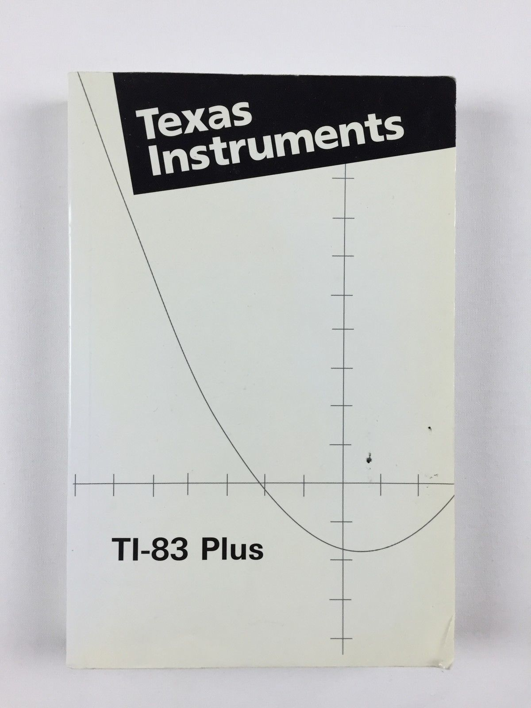
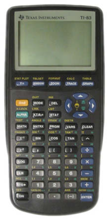

# Ti-83

I don't even remember the purpose of some of these programs ! :smile:

Everything was done on the calculator, no pc, no internet, only this 96×64 monochrome LCD screen and the amazing manual.

Decompiled using https://github.com/Darmo117/TI-83_Compiler.

<table>
    <tr>
        <td vlign="center"></td>
        <td vlign="center"></td>
    </tr>
</table>

